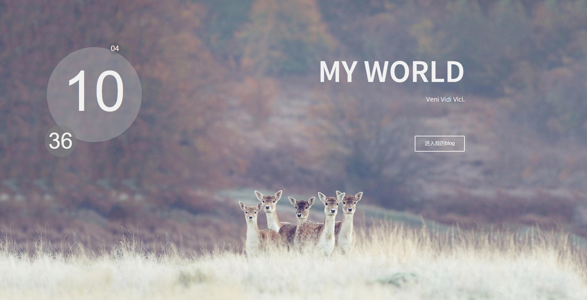

# description

> A blog project

## Build Setup

``` bash
# install dependencies
gem install jekyll

# build for production with minification
jekyll build

# serve with hot reload at localhost:4000
jekyll server


